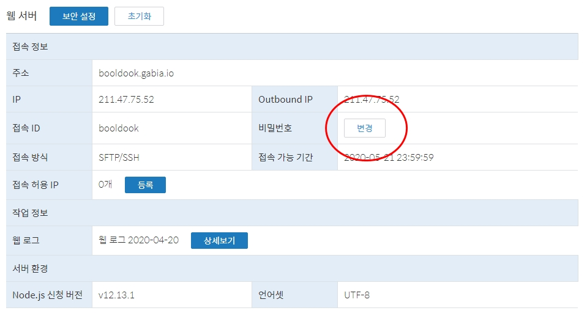
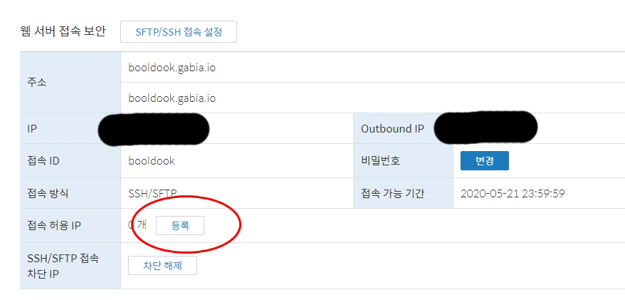
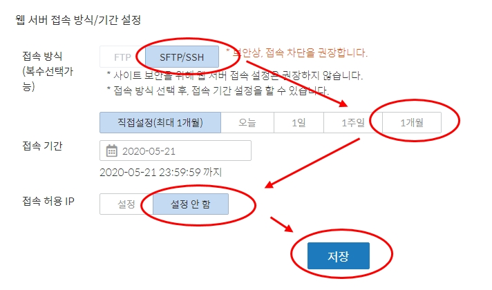
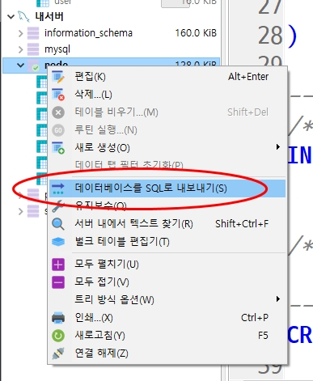
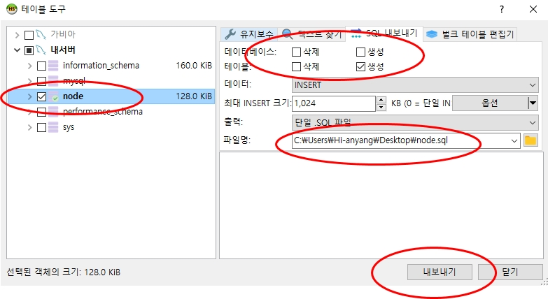
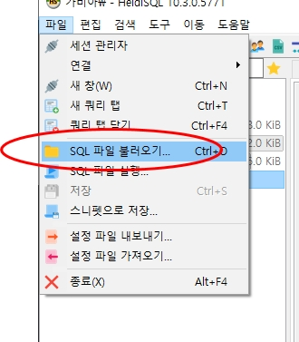
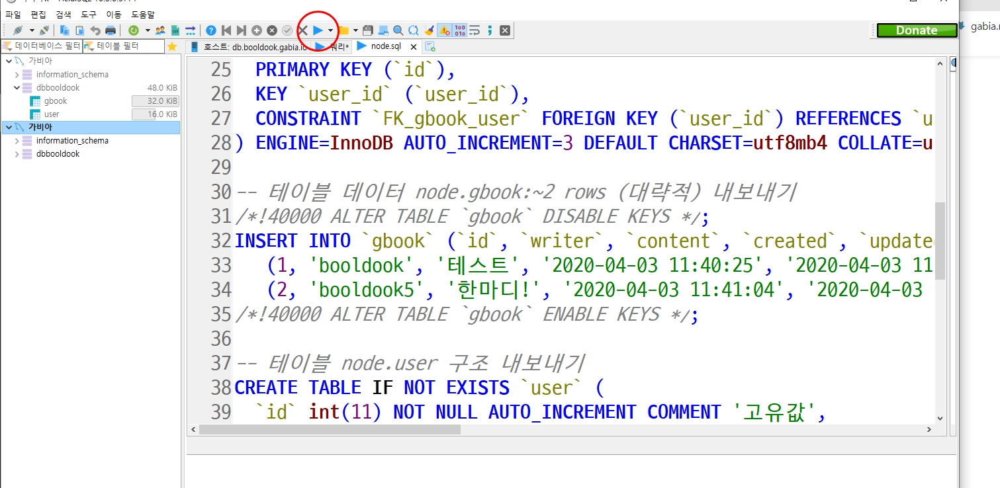
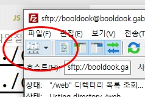
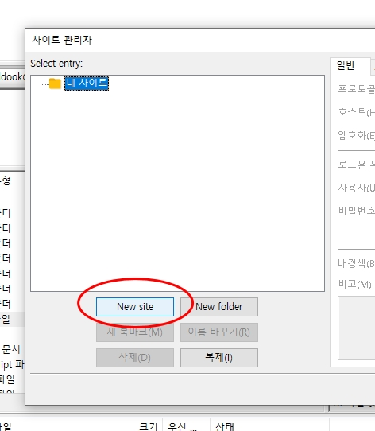
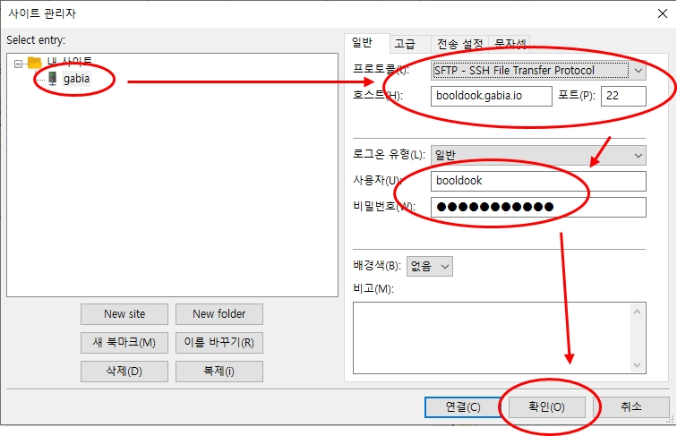

# Gabia Node 설정
## 1. MyGabia 에 접근하여 
## 2. 웹(sFTP), DB의 비밀번호를 지정한다.(한번만)

## 3. 한달에 한번 접근권한 설정을 해주어야 한다.




# Heidi 접속하여 데이터 베이스를 이전한다.
## 내서버 DB에 접속하여 sql 내보내기


## 가비아 DB에 접속하여 sql 불러오기





# .env 및 /modules/mysql.js 의 설정을 변경한다.
```js
// .env
PORT=8080
DB_HOST=db.booldook.gabia.io
DB=dbbooldook
DB_USER=booldook
DB_PASS=패스워드

// /modules/mysql.json
const connect = mysql.createPool({
	host: process.env.DB_HOST,
	port: 3306,
	database: process.env.DB,
	user: process.env.DB_USER,
	password: process.env.DB_PASS,
	connectionLimit: 10,
	waitForConnections: true,
});
```
# sFTP 접속
## 1. 파일질라 [다운로드](https://filezilla-project.org/) 링크에서 파일을 다운로드하여 설치한다.
## 2. 파일질라를 실행하여...
 
 

## 3. 접속된 /web 폴더 안에 node_modules 폴더를 제외한 모든 폴더를 업로드 한다. 

# SSH 서버접속
1. booldook.gabia.io 에 터미널 창을 열고 ssh 접속한다.
```bash
# ssh 접속
ssh booldook@booldook.gabia.io

# ssh 비밀번호 입력 - 혹시나 새로 계정생성을 한 경우에는 yes 눌러야 함.

# 업로드(node_modules)된 소스에서 package.json을 통한 node_modules를 생성한다.
npm i

# node app 을 통해 잘 구동되는지 확인한다.
node app

# 확인이 완료되면 pm2 start app.js 로 실서버를 구동한다.
pm2 start app.js
```